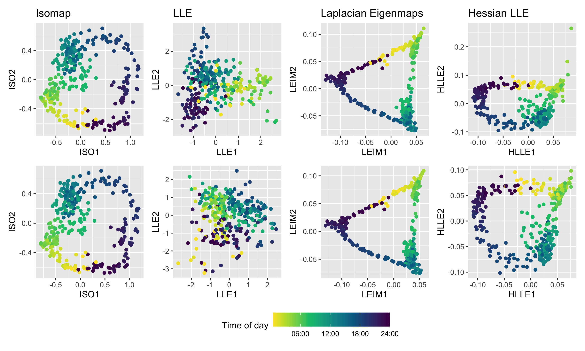
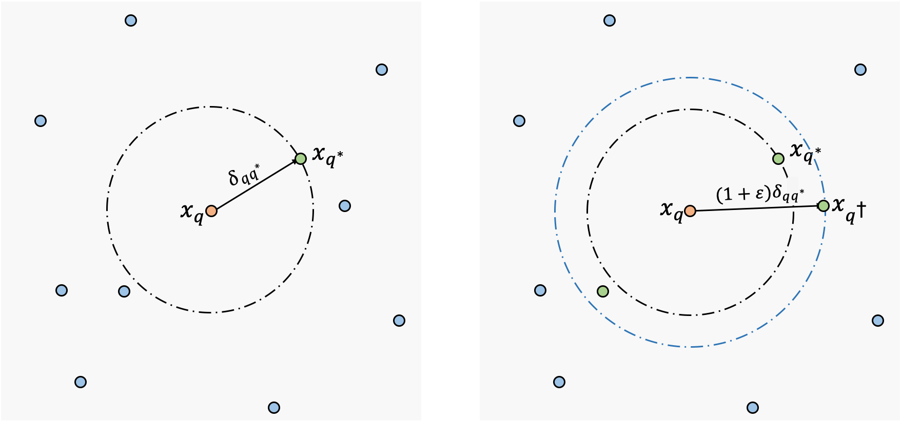
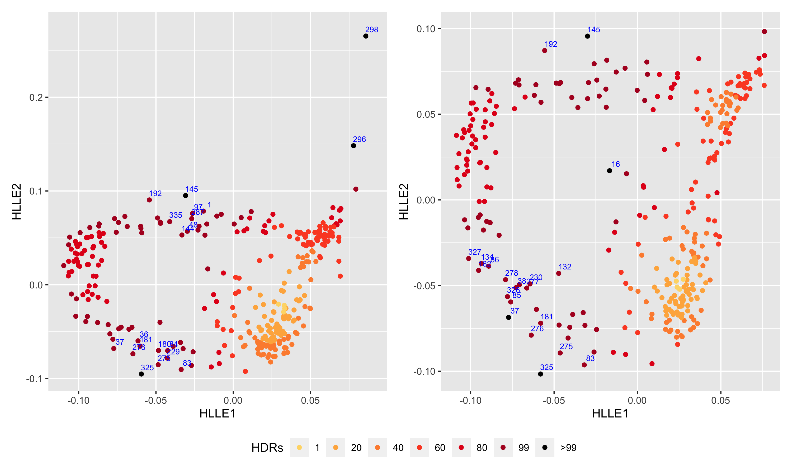

<!-- xaringan::inf_mr() -->
<!-- names(xaringan:::list_css())  # all possible themes -->
<!-- xaringan::infinite_moon_reader() # real-time view -->


```{r setup, include=FALSE}
options(htmltools.dir.version = FALSE)
# library(tidyverse)
# library(data.table)
# library(plotly)
# library(dimRed)
```


# Irish Smart Meter Data


- Problem of interest: electricity usage patterns of different households

- Half-hourly data for 535 days in 3639 households

- Empirical probability distributions of dimension $48*7=336$


```{r smartmeter, fig.align = 'center', out.width = "75%", fig.cap="Two smart-meter demand examples from the Irish smart meter data set.", echo = FALSE, message=FALSE, warning=FALSE}
# knitr::include_graphics("smartmeter.png")
load("smartmeter_2id.rda")
plotly::ggplotly(p, width=600, height=400)
```


---

# Manifold Learning for High-dimensional Data

- Manifold learning: non-linear dimension reduction tools by preserving the local geometry structure. 

```{r embedding, fig.align = 'center', out.width = "75%", fig.cap="Two smart-meter demand examples from the Irish smart meter data set.", echo = FALSE, message=FALSE}

```

- But what about 8 million household in VIC? 

---

## Manifold Learning with Approximate Nearest Neighbors (ANN)

<!-- .pull-left[ -->

- Computation efficiency matters

- We propose to improve the efficiency by searching for approximate nearest neighbors instead of exact ones. 

- ANN methods: k-d trees, Annoy, HNSW

- Goal: greatly decrease the computation time while remaining a high embedding quality

<!-- ] -->



<font size="2">
.caption[
c) $(1+\epsilon)$ approximate nearest neighbors. 
]


---

# Application: time-of-day electricity usage patterns


```{r ann, fig.align = 'center', out.width = "75%", fig.cap="Two smart-meter demand examples from the Irish smart meter data set.", echo = FALSE, message=FALSE}

```

---

# Application: anomaly detection for unusual households


```{r hdr, fig.align = 'center', out.width = "75%", fig.cap="Two smart-meter demand examples from the Irish smart meter data set.", echo = FALSE, message=FALSE}

```


 


