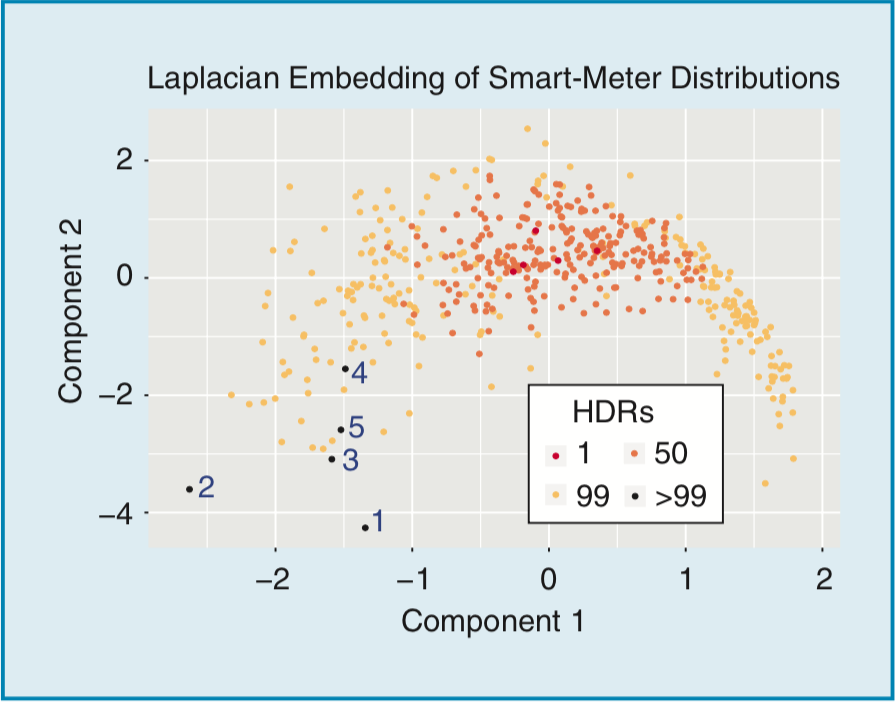
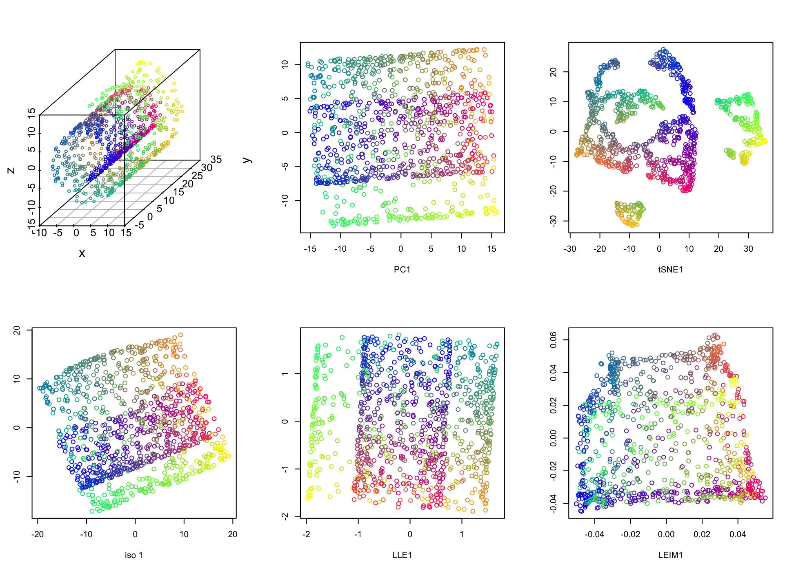
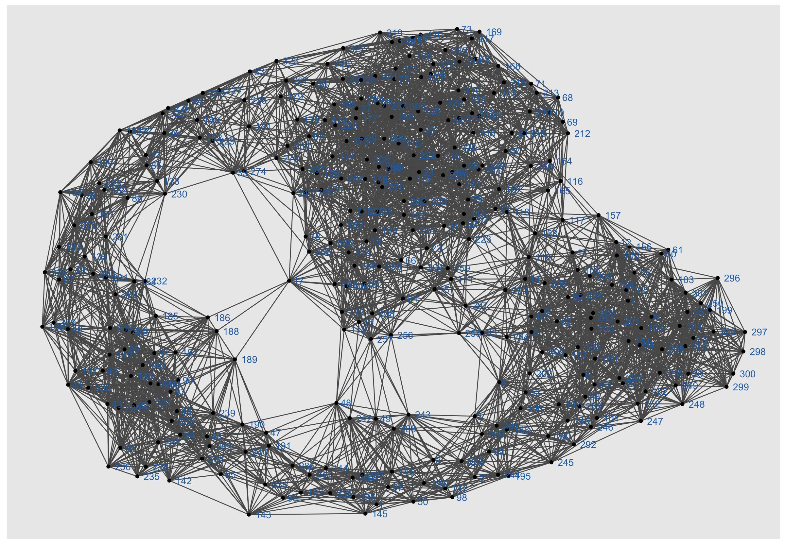
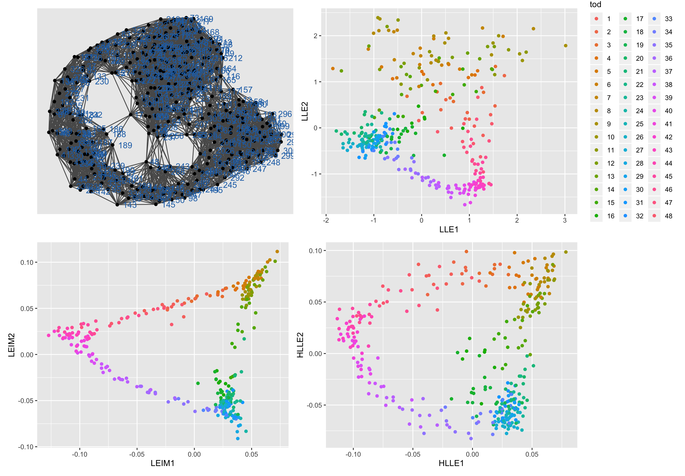
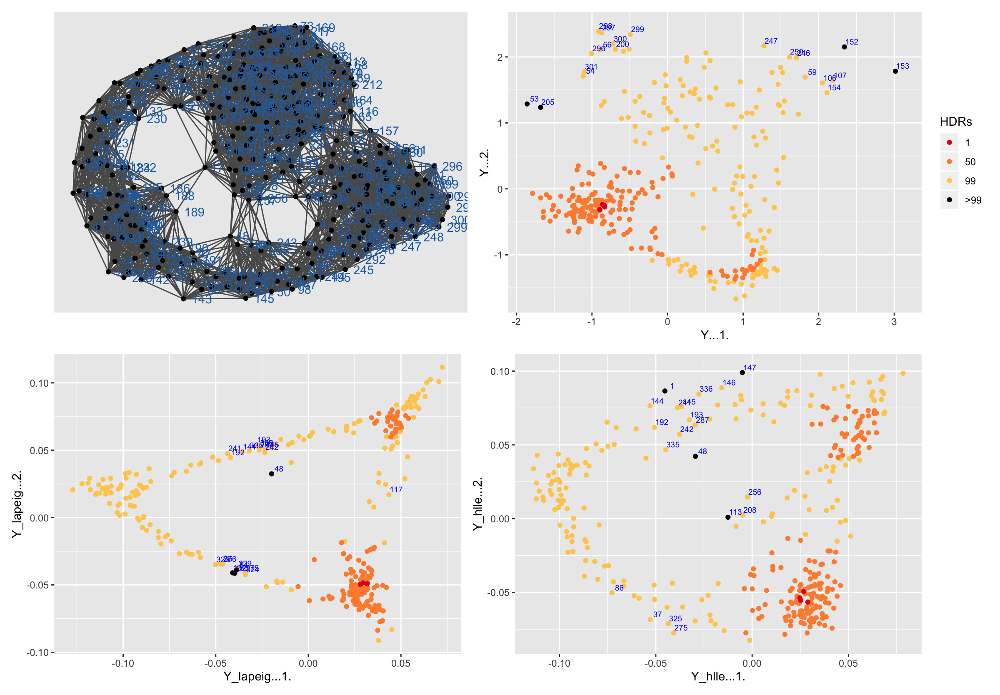

<!-- xaringan::inf_mr() -->
<!-- names(xaringan:::list_css())  # all possible themes -->
<!-- xaringan::infinite_moon_reader() # real-time view -->


```{r setup, include=FALSE, message=FALSE}
options(htmltools.dir.version = FALSE)
library(tidyverse)
library(data.table)
library(plotly)
library(dimRed)
```

```{r, load_refs, include=FALSE, cache=FALSE}
# library(RefManageR)
# BibOptions(check.entries = FALSE,
#            bib.style = "authoryear",
#            cite.style = "alphabetic",
#            style = "markdown",
#            hyperlink = FALSE,
#            dashed = FALSE)
# myBib <- ReadBib("./../Report/references.bib", check = FALSE)
```

# Background

.pull-left[
- Modern data often comprise a large number of high-dimensional observations

- Visualization and exploration of these data are challenging

- Dimensionality reduction tools to uncover the underlying lower-dimensional structure 

- Probability distributions to be the original high-dimensional space
]

.pull-right[

<font size="1">
.caption[
Figure from Hyndman, Liu & Pinson (2018): a 2-D representation of the electricity data from all 500 households. 
]
]
 

???

P2: challenging
- overwhelming and complex features -- irrelevant or redundant features will slow down the machine learning algorithms
- intrinsical lower-dimensional data points

P3: DR

Manifold learning is a well-founded option for dimensionality reduction, which explores the underlying lower-dimensional manifold structure of high-dimensional data.

P4: A possibly non-Euclidean space

Plot: why to do this

Hyndman, Liu & Pinson (2018) constructed the visualization of long series of electricity consumption data by first converting the demand data to distributions, and then embedding to a 2-D scatter plot.

The most typical points are shown in red, and the most unusual are shown in black

3 Problems: 

- only 500 households - not able to scale
- JS not the proper distance
- did not explore the proposition of different ML algorithms

Inspired by this idea, I propose to explore manifold learning methods on empirical probability distributions. 
---

# Irish smart meter data

.pull-left[
  
- **4225** households from smart metering trial

- Electricity consumption at **30-minute intervals** between 14 July 2009 and 31 December 2010 (**535** days)

- Many periods of missing data

- Heating/cooling energy usage excluded

]

.pull-right[
.center[
<!--  -->

]
]

- What about 8 million households in VIC?


???
Smart electricity meters are currently deployed in millions of households to collect detailed individual electricity consumption data on a near real-time basis


---

## Irish smart meter data

```{r smartmeter, fig.align = 'center', out.width = "75%", fig.cap="Two smart-meter demand examples from the Irish smart meter data set.", echo = FALSE, message=FALSE}
# knitr::include_graphics("smartmeter.png")
load("smartmeter_2id.rda")
plotly::ggplotly(p, width=600, height=400)
```


- Different meters have very different demand patterns 
- Time-of-day and day-of-week patterns hidden due to the volume of data

???
plotly -- zoom in to show the day-of-week pattern

- Thousands of smart meters, each with thousands of observations

---

# Quantiles conditional on time of week

- Avoids missing data issues and variation in series length

- Avoids timing of household events, holidays, etc

- Allows clustering of households based on probabilistic behavior rather than coincident behavior

    
- Sample quantiles better than kernel density estimate:

    - presence of zeros
    - non-negative support
    - high skewness


- For each household, compute sample quantiles $q$ at $p=0.01, 0.02, \dots, 0.99$ conditional on time of week 

- The data set of $3639\times535\times48=93,499,520$ observations is mapped to a set of $3639\times336\times99=121,047,696$ quantiles

- Compute *approximate discretized density* (like a probability mass function) at each x (equally spaced) given quantiles $q$ with probabilities p

???

[quantile plot by time of day]
The tenth percentile, for example, is the value below which 10% of the observations can be found

- impose some smoothness constrains on these distributions to improve estimates

- we could estimate the distribution at half-hour h using the data for half-hours h-1, h, h+1 as a form of kernel smoothing across half-hours


- explain how to go from quantiles to discretized discrete distributions??

pmf <- function(x, p, q)
{
  qcdf <- approx(q,p,xout=x,yleft=0,yright=1,ties=mean)$y # without ties, warnings come up
  qpmf <- c(0,diff(qcdf))
  return(qpmf / sum(qpmf))
}


---
class: inverse, center, middle

# Why manifold learning?

## To work with 336 distributions per household
---

background-image: url("sr.png")
background-size: 450px
background-position: 90% 90%

# Manifold learning


- *Manifold* -- where the data set lies on a low-dimensional Euclidean space embedded in a high-dimensional feature space


- Manifold learning methods: Isomap, LLE, Laplacian eigenmaps, etc
    
- Common steps: 
    
    - nearest neighbors finding
        
    - eigendecomposition of a certain matrix

???

- The attempt to recover the underlying nonlinear manifold structure from the data is called *manifold learning*
- Including Isomap, LLE, Laplacian eigenmaps, Hessian eigenmaps, local tangent space alignment, diffusion maps, and semidefinite embedding

- Dimentionality reduction methods: (based on the underlying manifold)

    - linear methods: principal component analysis (PCA) and multidimensional scaling (MDS)

        - PCA aims to attain the directions along which the data has the maximum variance
        - MDS is similar in spirit to PCA but it takes a dissimilarity matrix as input, and choose the configuration in $R^k$ whose coordinates are determined by the first $k$ eigenvectors of certain matrix derived from the input.


<!-- .pull-right[ -->
<!-- <iframe src="p.html" width="100%" height="400" id="igraph" scrolling="yes" seamless="seamless" frameBorder="0"> </iframe> -->
<!-- ] -->
---

### Manifold learning on Swissroll data

```{r swissroll, fig.align = 'center', out.width = "80%", fig.cap="Embedding results of Swissroll data with n=1000.", echo = FALSE, message=FALSE}

# dataset <- loadDataSet("Swiss Roll", n = 1000)
# embedded_data <- list()
# embed_methods <- dimRedMethodList()[c(17, 18, 9, 13, 12)]
# for (e in embed_methods) {
#   message("embedding: ", e)
#   embedded_data[[e]] <- embed(dataset, e, .mute = c("message", "output"))
# }
# par(mfrow = c(2,3))
# plot(dataset, type = "3vars")
# lapply(embedded_data, plot, type = "2vars")
```

???
Object: to understand the results of manifold learning

tSNE - mainly keeps the local structure, suitable for clustering

---
class: inverse, center, middle

# Manifold learning on large datasets

## For computational simplicity with smart meter data
---

# Approximate nearest neighbor searching

- The first step is to assign neighbors to each data point, which requires calculating pairwise distances

- The complexity of pairwise distances is $O(n^2)$ for n observations

- One solution: finding approximate nearest neighbors using kd-trees

- By constructing kd-trees, there is no need to compute all pairwise distances, and it scales the computation to $O(n\log(n))$

.pull-left[
.center[

<font size="1">
.caption[
kd-tree decomposition for the point set<br/>
(2,3), (5,4), (9,6), (4,7), (8,1), (7,2).
]
]
]

.pull-right[
.center[

<font size="1">
.caption[
The resulting kd-tree.
]
]
]


???
the process 
https://en.wikipedia.org/wiki/File:KDTree-animation.gif

- build kd-trees (binary tree)

- search in the tree instead of the original space

- $(1+\epsilon)$ nearest neighbor ?? 

---

# Connected neighborhood graph 

```{r neighbor, fig.align = 'center', out.width = "80%", fig.cap="Neighborhood graph for meter 1003 with k=20.", echo = FALSE}

```

???
- Subset *one household* for all time of week to get 336 distributions

- Circle structure uncovers the time-of-day pattern

---

## Approximate spectral decomposition

- Spectral decomposition is intractable for large $n$, especially in the case where the matrix is dense and too large to be stored 

- Talwalkar, Kumar & Rowley (2012) introduced two methods for approximating spectral decomposition of a large matrix using a subset of the columns (or rows) of the matrix 

    - Nyström method
    
    - Column-sampling approximation

???
- find a pic??

---
class: inverse, center, middle

# Manifold learning with distances between distributions

### Can we make the pairwise distances behave like "Euclidean" fashion

???
[quantile plots 1 <- distances -> quantile plots 2]

---
# Distances between distributions

###  Kullback-Leibler divergence

$$D(P \| Q)=\int_{-\infty}^{\infty} p(x) \log \frac{p(x)}{q(x)} dx.$$
- Not symmetric: $D(P\|Q) \neq D(Q\|P)$

- Not satisfy triangle inequality: $D(x, z) \leq D(x, y)+D(y, z)$

--

### Jensen-Shannon divergence

$$\mathrm{JSD} (P \| Q) = \frac{1}{2} D(P \| M) + \frac{1}{2} D(M \| Q), \quad \text{where} \ M=\frac{1}{2}(P+Q)$$
- Symmetrized and smoothed version of the KL divergence

- Not satisfy triangle inequality

---
# Distances between distributions

### Hellinger distance

For two discrete probability distributions $P=\left(p_{1}, \ldots, p_{k}\right)$ and $Q=\left(q_{1}, \ldots, q_{k}\right),$ their Hellinger distance is defined as
$$H(P, Q)=\frac{1}{\sqrt{2}} \sqrt{\sum_{i=1}^{k}\left(\sqrt{p_{i}}-\sqrt{q_{i}}\right)^{2}},$$
which is directly related to the Euclidean norm of the difference of the square root vectors, i.e.
$$H(P, Q)=\frac{1}{\sqrt{2}}\|\sqrt{P}-\sqrt{Q}\|_{2}.$$

- Symmetric: $H(P, Q)=H(Q, P)$
- Satisfy triangle inequality
- A "distance" rather than a "divergence"

---

# Manifold learning with Hellinger distance

- The input for ML is the pairwise distance matrix between data points

- Non-Euclidean distances between probability distributions -- take probability distributions as observations

- Euclidean distances in constructing neighborhood graph -- ANN using kd-trees

--
- Solution: Hellinger distance

$$H(P, Q)=\frac{1}{\sqrt{2}}\|\sqrt{P}-\sqrt{Q}\|_{2}$$ 

  - calculate the square root vectors of the probabilities as the input, namely $\sqrt{P}$ and $\sqrt{Q}$
  - then the pairwise Hellinger distances behave as the Euclidean distances, regardless of the constant $\frac{1}{\sqrt{2}}$

---
## Manifold learning embedding plots

```{r embedding, fig.align = 'center', out.width = "80%", fig.cap="Embedding from three spectral embedding methods. The first subplot is the neighborhood graph. The colors represent half-hourly time of day.", echo = FALSE}

```

---
class: inverse, center, middle

# Manifold learning evaluation

### How to compare the embeddings from different methods?

---

# Anomaly detection

- Compute contours, or highest density regions (Hyndman, 1996) of the embedding

- Rank the observations according to the density of the embedding, and then identify which observations lie in an HDR of specified coverage

- Identify the most unusual observations (*"anomalies"*) as those with the lowest density values (Hyndman, Liu & Pinson, 2018)

---

## High density region plot

```{r hdr, fig.align = 'center', out.width = "85%", fig.cap="High density region plot from one household (meter 1003). The most typical points are shown in red, while the most anomalous are shown in black.", echo = FALSE}

```
---

# Out-of-sample embedding

- Out-of-sample extension of ML -- how to locate new points

- Not only *novel points* located within the empirically learned manifold, but also the slightly *off-manifold points* 

- Baker (1977) proposed to use the Nyström formula on a subset of sample

- Bengio et al. (2004) proposed to formulate a data-dependent kernel function, $M_{ij} = k_n(x_i, x_j)$

- Cross-validation, robustness testing

???
off-manifold points: 

noise caused in the data acquisition or input preprocessing stages

---
## Timeline

| Date                 | Tasks
|---------------------|--------------------------------------------------------------|
| Feb 2019 -- Feb 2020 | • Review literature and propose research questions  |
|                      | • Visualize and explore toy datasets and smart meter data  |
|                      | • Work on confirmation report and thesis structure  |
| Mar 2020 -- Jul 2020 | • Conduct approximate spectral decomposition on the data       |
|                      | • Draft the first paper about **ML on large datasets**  |
| Aug 2020 -- Feb 2021 | • Apply multiple ML algorithms with distributions to the electricity data    |
| Mar 2021 -- Jul 2021 | • Draft the second paper on **ML with distances between distributions**       |
| Aug 2021 - Feb 2022  | • Explore out-of-sample embedding for different ML algorithms        |
| Mar 2022 -- May 2022 | • Draft the third chapter on **ML evaluation**   |
|                      | • Finalise the thesis                               |

---

class: inverse, center, middle

# Thanks!

