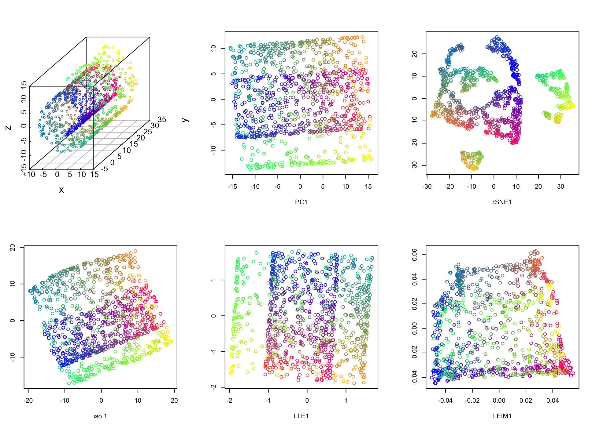
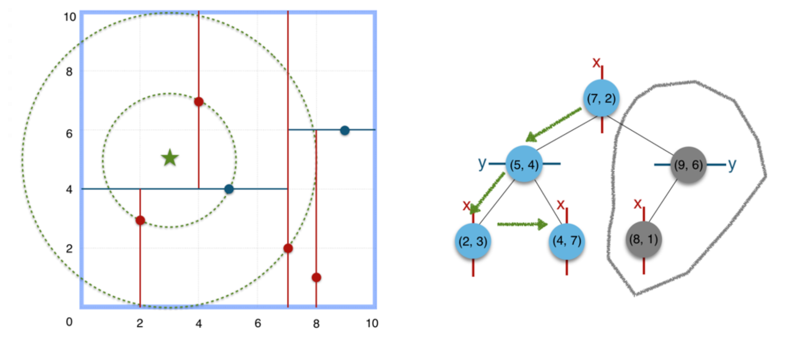
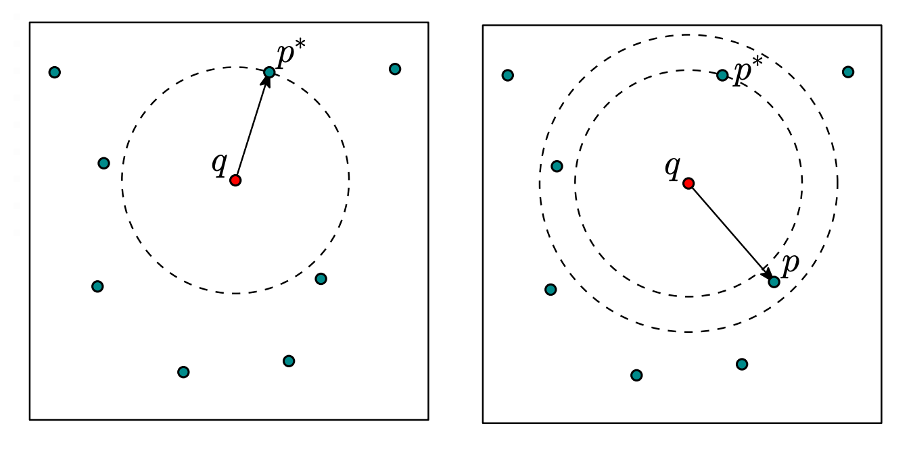
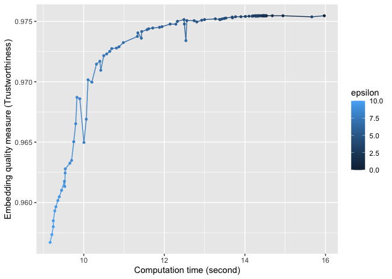

<!-- xaringan::inf_mr() -->
<!-- names(xaringan:::list_css())  # all possible themes -->
<!-- xaringan::infinite_moon_reader() # real-time view -->


```{r setup, include=FALSE}
options(htmltools.dir.version = FALSE)
# library(tidyverse)
# library(data.table)
# library(plotly)
# library(dimRed)
```


### Manifold Learning with Approximate Nearest Neighbors

.pull-left[

<font size="2">
.caption[
a) Manifold learning embeddings for 3-D Swiss Roll data. 
]


<font size="2">
.caption[
b) k-d trees for nearest neighbor searching. 
]

]

.pull-right[

<font size="2">
.caption[
c) $(1+\epsilon)$ approximate nearest neighbors. 
]


<font size="2">
.caption[
d) Isomap embedding quality against computation time using approximate nearest neighbors. 
]

]
 


    


