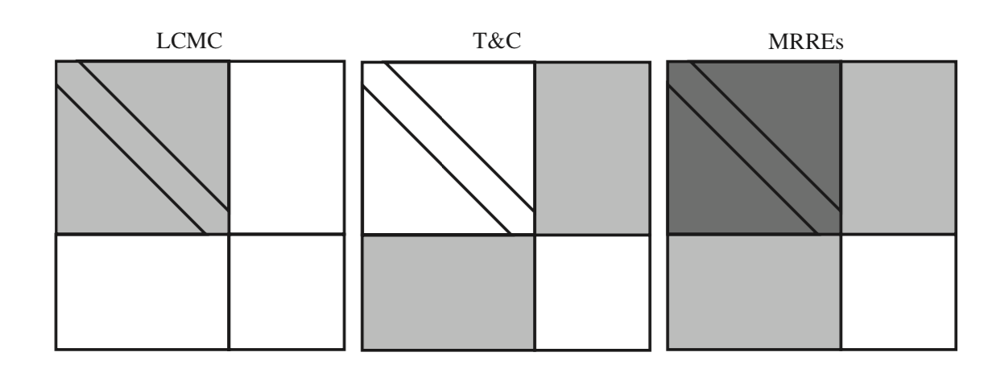
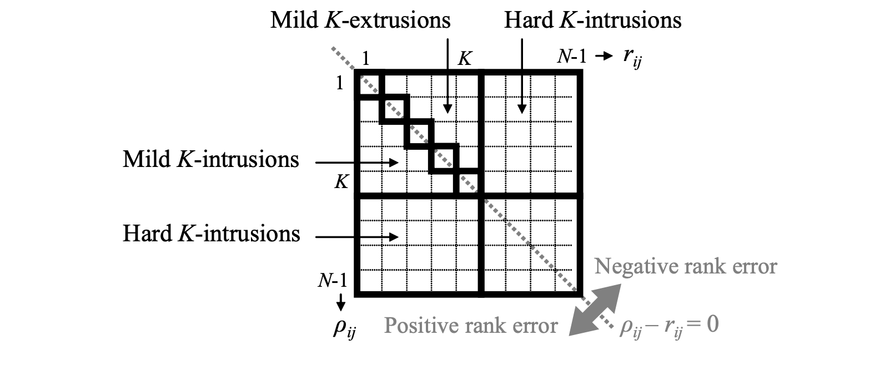
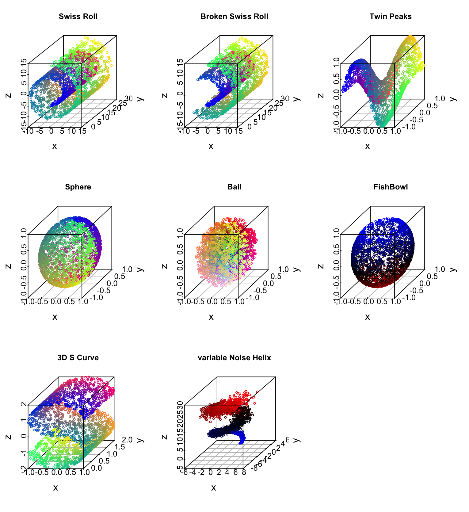

```{r setup, include=FALSE}
knitr::opts_chunk$set(echo=TRUE, cache=FALSE, messages=FALSE, warning=FALSE)
options(tinytex.verbose = TRUE)
```

```{r packages, include=FALSE}
library(dimRed)
library(tidyverse)
library(ggplot2)
library(reshape2)
library(knitr)
library(kableExtra)
library(tibble)
set.seed(1)
source("annIsomap.R")
source("dr_quality.R")
```


# Notation

The data points are denoted as $x_i, i=1,\dots,N$ in high-dimensional space $\mathbb{R}^D$ and $y_i, i=1,\dots,N$ in low-dimensional space $\mathbb{R}^d$. While $\delta_{ij}$ and $d_{ij}$ denote the distance from $x_i$ to $x_j$ and the distance from $y_i$ to $y_j$ respectively. 

Based on the distances, the ranks of the points $x$ in high-dimensional space can be calculated as $\rho_{ij} =|\left\{k: \delta_{i k}<\delta_{i j} \text { or }\left(\delta_{i k}=\delta_{i j} \text { and } k<j\right)\right\} |$, where $|\cdot|$ denotes the set cardinality. And the ranks of $y$ are denoted as $r_{ij} = |\left\{k: d{i k}<d{i j} \text { or }\left(d{i k}=d{i j} \text { and } k<j\right)\right\} |$. 

Then the $K$-ary neighborhoods of $x_i$ and $y_i$ can be denoted as $U_K(i) = {j: 1 \leq \rho_{ij} \leq K}$ and $V_K(i) = {j: 1 \leq r_{ij} \leq K}$, respectively, where $K$ is the size of the neighborhood. 

The co-ranking matrix [@Lee2008-sx] can then be defined as
\begin{equation} 
\label{equ:coRanking}
\mathbf{Q}=\left[Q_{k l}\right]_{1 \leqslant k, l \leqslant N-1}, \ \text{with} \ \  Q_{k l}=|\left\{(i, j): \rho_{i j}=k \text { and } r_{i j}=l\right\}|.
\end{equation}


# Swissroll dataset

To demonstrate, we now apply manifold learning algorithms to the widely-used Swissroll dataset. The key idea to build the Swissroll mapping is to randomly generate $N$ data points in two-dimensional space, called meta data, and then map them to a three-dimensional space with specific smooth functions and some error terms, denoted as $X$. The manfold learning algorithms are then applied to the 3-D data $X$ to get a 2-D embedding $Y$. In this way, the algorithms can be applied to obtain the embedding $Y$, and compare it with the meta data. 

Suppose a manifold is given by
$$
X = \mathcal{M}(\theta) + \varepsilon,
$$
where $\mathcal{M}(\theta)$ is the parameterization of the manifold and $\varepsilon \sim \mathcal{N}(\mu, \ \sigma^{2})$ is the error term.

The mapping function for Swissroll data is given by 
$$
\left\{ 
\begin{array}{lcl}
X_1 = \theta_1 \times \cos{\theta_1} + \varepsilon_1, \\
X_2 = \theta_2 + \varepsilon_2, \\
X_3 = \theta_1 \times \sin{\theta_1} + \varepsilon_3.
\end{array}
\right.
$$

Here we consider a Swissroll dataset consists of `N=2000` points, and the error term $\varepsilon \sim \mathcal{N}(0, \ 0.05^{2})$. The 3-D plot of Swissroll data and the corresponding meta data are shown in Figure \@ref(fig:sr). 

```{r sr, fig.align='center', out.width="100%", fig.cap="The 3-D plot and the corresponding meta data plot of a Swissroll data with N=2000.", echo=TRUE, include=TRUE}
N <- 2000; sigma <- 0.05
sr <- dimRed::loadDataSet("Swiss Roll", n = N, sigma = sigma)
cols <- dimRed:::colorize(sr@meta[,seq_len(min(3, ncol(sr@meta))),drop=FALSE])
meta <- sr@meta
par(mfrow = c(1,2))
plot(sr, type = "3vars")
plot(sr@meta, col = cols, xlab = "")
```


# Isomap embedding

Isomap, short for isometric feature mapping, was one of the first algorithms introduced for manifold learning. 
It can be viewed as an extension to MDS, a classical method for embedding dissimilarity information into Euclidean space. Isomap consists of three main steps:     

1). Construct the $K$-nearest neighborhood graph for the high-dimensional dataset; 

2). Estimate the geodesic distances (distances along a manifold) between points in the input using shortest-path distances (Dijkstra’s or Floyd’s, @Dijkstra1959-ml; @FloydRobert1962-au) on the neighborhood graph;  

3). Use MDS to find points in low-dimensional Euclidean space whose interpoint distances match the distances found in Step 2.

When applying Isomap to the Swissroll data, we initialize the number of nearest neighbors (NN) as `K=50`, and the number of embedded dimensions as `d=2`. The 2-D embedding plot is show in Figure \@ref(fig:mapping) (b). 

```{r isomap, message=FALSE}
K <- 50; d = 2
sr_isomap <- embed(sr, "Isomap", knn = K, ndim = d, get_geod = FALSE, 
                   .mute = c("message", "output"))
# X: 3d sr data; Y: 2d embedded data; meta: 2d meta data
X <- as.matrix(sr_isomap@org.data)
Y <- sr_isomap@data@data
pars <- sr_isomap@pars
```


# Isomap with approximate nearest neighbors (ANN)

The first step of Isomap is to assign neighbors to each data point, which requires calculating pairwise distances. The complexity of pairwise distances is $O(N^2)$ for $N$ observations, which is not efficient when the data size $N$ is large. 
 
One solution for large data size is finding approximate nearest neighbors using kd-trees. By constructing kd-trees, there is no need to compute all pairwise distances, and it scales the computation to $O(N\log(N))$. 

When using kd-trees, the dedault value for the error bound parameter is $\epsilon=0$, which implies exact nearest neighbour search. By tuning this parameter, we could attain the embedding using ANN. We start with $\epsilon=1$ and get the embedding plot in Figure \@ref(fig:mapping) (c).

```{r annIsomap, message=FALSE}
eps <- 1
sr_isomap_ann <- embed(sr, "annIsomap", knn = K, eps = eps, ndim = d)
X1 <- as.matrix(sr_isomap_ann@org.data)
Y1 <- sr_isomap_ann@data@data
pars1 <- sr_isomap_ann@pars
```

```{r mapping, fig.align='center', out.width="100%", fig.cap="The Swissroll meta data and the Isomap 2-D embedding using exact NN and ANN with K=50 and eps=1. (a) Swissroll meta data with N=2000 points; (b) Isomap embedding of Swissroll data using exact NN; (c) Isomap embedding of Swissroll data using ANN.", echo=FALSE, include=TRUE}
par(mfrow = c(1,3))
plot(meta, col = cols, xlab = "", main = "(a)")
plot(sr_isomap, type = "2vars", main = "(b)")
plot(sr_isomap_ann, type = "2vars", main = "(c)")
```


# Quality measures

With various manifold learning algorithms, it is worth considering the question of quality assessment to compare and choose from these methods. We can also apply these measures to explore different variation of each method, including using exact NN and ANN. @Lee2008-cx and @Gracia2014-ae provided some good reviews on the rank-based criteria of dimensionality reduction quality. 

Manifold learning aims at a mapping $\mathcal{M}$ from high-dimensional datasets to low-dimensional representations such that $\mathrm{y} = \mathcal{M}(\mathrm{x})$. If we could obtain the inverse $\mathcal{M}^{-1}$ in closed form, then the reconstruction error can be used as a quality criterion among and within different methods. The reconstruction error can be written as an expectation 
$$
E_{\mathrm{rec}}=\mathrm{E}\left[ \left(x-\mathcal{M}^{-1}(\mathcal{M}(x))\right)^{2} \right].
$$
This approach is only applicable to few algorithms, such as PCA and auto-encoders, bacause most ML methods are nonparametric and the closed form of $\mathcal{M}$ and $\mathcal{M}^{-1}$ is not available. 

Since most methods aim at optimizing a given objective function, it is straightforward to calculate the value of objective function after convergence. However, due to different settings of the function, this comparison is limited within the same algorithm. 

Then, we try to assess the intrinsic goal of preserving the data set structure, which can be relaxed in the constrains as in the objective function. For a broader applicability, several quality assessment criteria have been proposed, including three rank-based criteria: the trustworthiness and continuity (T&C) measures [@Venna2006-nd], the local continuity meta-criterion (LCMC) [@Chen2009-su], and the mean relative rank errors (MRREs) [@Lee2007-wq], and Procrustes measure [@Goldberg2009-tb]. All these criteria are built upon the idea that a faithful embedding preserves the local neighborhood structure of each point [-@Goldberg2009-tb]. 
Therefore, they determine the quality of the embedding by analyzing the degree in preserving the K-ary neighborhood structures, for varying value of K. 


## Trustworthiness & Continuity (T&C)

@Venna2006-nd defined two quality measures for manifold embeddings to distinguish two type of errors where distant points become neighbors, or neighbors are embedded faraway from each other. 

- the trustworthiness of the embedding, where trustworthiness errors are defined as distant input points that entered the same output neighborhood. 
\begin{equation}
\label{trustworthiness}
M_{T}(K)=1-\frac{2}{G_{K}} \sum_{i=1}^{N} \sum_{j \in V_{K}(i) \notin U_{K}(i)}(\rho{ij}-K),
\end{equation}
where the normalizing factor
$$
G_{K}=\left\{\begin{array}{ll}
N K(2 N-3 K-1) & \text { if } K<N / 2, \\
N(N-K)(N-K-1) & \text { if } K \geqslant N / 2.
\end{array}\right.
$$

- the continuity of the embedding, where continuity errors are defined as data points in the same input neighborhood but in different output neighborhood. 
\begin{equation}
\label{continuity}
M_{C}(K)=1-\frac{2}{G_{K}} \sum_{i=1}^{N} \sum_{j \in U_{K}(i) \notin V_{K}(i)}(r{ij}-K).
\end{equation}

<!-- By introducing a parameter $\alpha \in[0,1]$, the T&C measure is defined as: 
$$
Q_{T}(K)=\alpha M_{T}(K)+(1-\alpha) M_{C}(K).
$$
The interval of $Q_T(K)$ is $[0,1]$, and higher values means a good preservation of trustworthiness and continuity.  -->


## Mean Relative Rank Errors (MRREs)

@Lee2008-cx developed the mean relative rank errors which is based on similar principle to that of the T&C, while the two elements are defined as 
\begin{equation}
\label{MRREs}
\begin{aligned}
&W_{n}(K)=1-\frac{1}{H_{K}} \sum_{i=1}^{N} \sum_{j \in U_{K}(i)} \frac{|\rho{ij}-r{ij}|}{\rho{ij}}, \\
&W_{\nu}(K)=1-\frac{1}{H_{k}} \sum_{i=1}^{n} \sum_{j \in V_{k(i)}} \frac{|\rho{ij}-r{ij}|}{r{ij}},
\end{aligned}
\end{equation}

where $H_K$ is the normalizing factor defined as
$$
H_{K}=n \sum_{i=1}^{K} \frac{|N-2 i+1|}{i}.
$$
The MRREs criterion $Q_M$ evaluates (using an error value) the first K rows and columns of the co-ranking matrix $\mathrm{Q}$.
<!-- as
$$
Q_{M}(K)=\beta W_{n}(K)+(1-\beta) W_{\nu}(K).
$$ -->


## Local Continuity Meta-Criterion (LCMC)

@Chen2009-su suggested the local continuity criterion to compute the average size of the overlap of K-nearest neighborhoods in the low-dimensional embedding and in the high-dimensional space. The LCMC is defined as 
\begin{equation}
\label{LCMC}
Q_{LC}(K)=1-\frac{1}{N K} \sum_{i=1}^{N}\left| U_K(i) \bigcap V_K(i) \right|-\frac{K^{2}}{N-1}.
\end{equation}

If the overlap between two $K$ neighboring sets is calculated, then the $Q_{LC}(K)$ gives a general measurement for the local faithfulness of the computed embeddings. The interval of $Q_{LC}(K)$ is $[0,1]$, and values next to 1 mean a high neighborhood overlap between the two dimensional spaces, and next to 0 values the opposite. 


From an intuitive point of view, T&C and MRREs try to detect what goes wrong in a given embedding, whereas the LCMC accounts for things that work well. 


## Co-ranking Matrix ($Q_{NX}(K)$)

Many different concepts and quality criteria for DR can be summarized using the co-ranking framework, presented by @Lee2008-cx. Several of the aforementioned methods based on distance ranking in local neighborhoods (T&C, MRREs, LCMC), are easily unified into an overall framework. 

The co-ranking matrix $\mathrm{Q}$ is defined in Equation \@ref(equ:coRanking) with its element being
$$
Q_{kl}=\left|\left\{(i, j) | \rho_{i j}=k \text { and } r_{i j}=l\right\}\right|.
$$

Errors of a DR mapping correspond to off-diagonal entries of this co-ranking matrix. 
A point $j$ that gets a lower rank with respect to a point $i$ in the low-dimensional space than in the
high-dimensional space, i.e. $\rho_{ij} > r_{ij}$, is called an *intrusion*. Analogously, if $\delta_j$ has a higher rank in the low-dimensional space it is called an *extrusion*. As shown in Figure \@ref(fig:Kins) from @Lee2008-cx, intrusions and extrusions correspond to off-diagonal entries in the upper or lower triangle, respectively. 

We can also associate the above quality measures with co-ranking matrix using the idea of intrusions and extrusions as Figure \@ref(fig:matrix).

```{r matrix, fig.align='center', out.width="100%", echo=FALSE, include=TRUE, fig.cap="For all pairs of quality criteria, a schematic illustration of the co-ranking matrix is shown: the blocks that are taken into account are shaded. The LCMC quantifies the true positives, the TC focus on the false positives and false negatives, and the MRREs encompass the positives (true and false) and negatives (true and false). For the MRREs, the block UL is covered twice."}

```

Since the preservation of local relationships is important, rank errors for large ranks are not as critical as rank errors of close points. 
Therefore, Lee and Verleyssen distinguished two types of intrusions/extrusions, those within a $K$-neighborhood, which are benevolent, and those moving across this boundary, which are malign with respect to quality. 
A *K-intrusion* (resp. *K-extrusion*) is an intrusion for which $r_{ij} < K$ (resp. $\rho_{ij} < K$). 
Subsequently, mild K-intrusions are events for which $r_{ij} < \rho_{ij} \leq K$, while hard K-intrusions are defined by $r_{ij} \leq K < \rho_{ij}$. Mild K-extrusions and hard K-extrusions are defined accordingly.

```{r Kins, fig.align = 'center', out.width = "100%", echo = FALSE, fig.cap="Block division of the co-ranking matrix, showing the different types of intrusions and extrusions, and their relationship with the rank error."}

```


Define $Q_{NX}(K)$ as the criterion that summarizes co-ranking matrix $\mathrm{Q}$ in a simple way: it counts the number of points that remain inside the K-neighborhood while projecting, i.e., all points which keep their rank, and all mild in- and extrusions. It is defined as 
\begin{equation}
\label{Q_NX}
Q_{NX}(K)=\frac{1}{K N} \sum_{k=1}^{K} \sum_{l=1}^{K} Q_{k l}.
\end{equation}

The range is $Q_{N X}(K) \in[0,1]$, where 1 means a perfect embedding. 


<!-- ### $Q_{\text{local}}$ and $Q_{\text{global}}$

It is similar to LCMC and there exists the following linear form
$$
Q_{LC}(K) = Q_{NX}(K) - \frac{K}{N-1}.
$$
Thus, the range of $Q_{LC}(K)$ depends on the value of K. To estimate which values of K should be considered local, the following splitting point was proposed [@Lee2008-cx]:
$$
K_{\max }=\arg \max _{K} Q_{LC}(K)=\arg \max _{K}\left(Q_{NX}(K)-\frac{K}{N-1}\right).
$$

Subtracting the baseline ensures that there is a well-defined maximum that favors locality.
Given the splitting point, a local and a global quality measure is obtained by averaging the respective parts of the quality graphs:
$$
\begin{aligned}
Q_{\text {local}} &=\frac{1}{K_{\max }} \sum_{K=1}^{K_{\max }} Q_{\mathrm{NX}}(K), \\
Q_{\text {global}} &=\frac{1}{N-K_{\max }} \sum_{K=K_{\max }}^{N-1} Q_{\mathrm{NX}}(K).
\end{aligned}
$$

Both values range from 0 to 1. As local properties are more important, the authors advise to rank methods according to $Q_{\text{local}}$ and only to consider $Q_{\text{global}}$ in case of a tie.


### Modified criterion: $R_{NX}(K)$

In order to fairly compare or combine values of $Q_{NX}(K)$ for different neighborhood sizes K, @Lee2015-tc rescaled the criterion as
$$R_{\mathrm{NX}}(K)=\frac{(N-1) Q_{\mathrm{NX}}(K)-K}{N-1-K},$$
for $1 \leq K \leq N-2$. This modified criterion indicates the improvement over a random embedding and has the same useful range between 0 (random) and 1 (perfect) for all K. 

Moreover, a scalar score is obtained by computing the area under the $R_{NX}(K)$ curve in the log plot, with a logarithmic scale for K, given by 
$$
\mathrm{AUC}_{\ln K}\left(R_{NX}(K)\right)=\left(\sum_{K=1}^{N-2} R_{NX}(K) / K\right) /\left(\sum_{K=1}^{N-2} 1 / K\right).
$$
The AUC assesses the average DR quality on all scales, with supposedly the most appropriate weights. The higher the AUC, the better the result is.
 -->


## Procrustes measure ($R(X,Y)$)

Despite the $K$-ary neighborhood based measures, @Goldberg2009-tb also presented the Procrustes measure, a novel measure based on Procrustes rotation that enables quantitative comparison of the output of manifold learning algorithms. The function based on the Procrustes analysis works as a measure of local embedding quality, and compares each neighborhood in the highdimensional space and its corresponding low-dimensional embedding. 

First, define the Procrustes statistic $G(X, Y)$ as
$$
\begin{aligned}
G(X, Y) &= \inf _{\left\{A, b: A^{\prime} A=I, b \in \mathbb{R}^{D}\right\}} \sum_{i=1}^{k}\left\|x_{i}-A y_{i}-b\right\|^{2} \\
&= \inf _{\left\{A, b: A^{\prime} A=I, b \in \mathbb{R}^{D}\right\}} \operatorname{tr}\left(\left(X-Y A^{\prime}-1 b^{\prime}\right)^{\prime}\left(X-Y A^{\prime}-1 b^{\prime}\right)\right) \\
&= \inf _{\left\{A: A^{\prime} A=I\right\}} \operatorname{tr}\left(\left(X-Y A^{\prime}\right)^{\prime} H\left(X-Y A^{\prime}\right)\right) \\
&= \inf _{\left\{A: A^{\prime} A=I\right\}}\left\|H\left(X-Y A^{\prime}\right)\right\|_{F}^{2},
\end{aligned}
$$
where $\left\| \cdot \right\|_{F}$ is the Frobenius norm.


They define how well an embedding preserves the local neighborhoods using the Procrustes statistic $G(X_i,Y_i)$ of each neighborhood-embedding pair $(X_i,Y_i)$. Therefore, a global embedding that preserves
the local structure can be found by minimizing the sum of the Procrustes statistics of all neighborhood-embedding pairs.

Let $X_{i}$ be the neighborhood of $x_{i}(i=1, \ldots, N)$ in the high dimension and $Y_{i}$ be its embedding. Define
\begin{equation}
\label{procrustes}
R(X, Y)=\frac{1}{N} \sum_{i=1}^{N} G \left(X_{i}, Y_{i}\right).
\end{equation}

The function $R$ measures the average quality of the neighborhood embeddings. Embedding $Y$ is considered better than embedding $\tilde{Y}$ in the local-neighborhood-preserving sense if $R(X, Y) < R(X, \tilde{Y})$. This means that on the average, $Y$ preserves the structure of the local neighborhoods better than $\tilde{Y}$.


# Quality measures for Isomap embeddings 

With these quality measures, we can further calculate the Isomap embedding quality of both exact NN and ANN as shown in Table \@ref(tab:quality).

```{r dr_quality, message=FALSE}
quality_isomap <- dr_quality(X, Y, pars)
quality_isomap_ann <- dr_quality(X1, Y1, pars1)
qualities <- rbind(quality_isomap$quality, quality_isomap_ann$quality)[, 1:6]

compare <- microbenchmark::microbenchmark(
  embed(sr, "Isomap", knn = K, ndim = d, get_geod = FALSE),
  embed(sr, "annIsomap", knn = K, eps = eps, ndim = d, get_geod = FALSE),
  times = 3,
  unit = "s"
)
# average running time
Time_sec <- summary(compare)[,"mean"]
```

```{r quality, echo=FALSE}
qualities <- cbind(qualities, Time_sec)
row.names(qualities) <- c("NN", "ANN")
knitr::kable(qualities, digits = 3, 
             caption = "Isomap embedding quality using NN and ANN.") %>%
  kable_styling(latex_options = "striped", full_width = TRUE)
```

# Improvements

The difference of the quality measures between exacct NN and ANN is not obvious. To improve the results, there are several tuning parameters. 

## Optimal parameters: K, eps

By varying the values of `K` and `eps`, the quality measures can guide in finding the optimal parameters. The optimal value for K can be obtained from the quality output, which is `r as.numeric(rownames(qualities)[1])`. Then we focus on tuning `eps`.

```{r optimal_eps, message=FALSE, cache=TRUE, echo=TRUE, eval=TRUE}
K <- qualities$K[1]
eps_seq <- seq(0, 2, 0.1)
quality_eps <- matrix(NA, length(eps_seq), ncol(qualities) + 1)
colnames(quality_eps) <- c(colnames(qualities), "eps")

for(i in 1:length(eps_seq)){
  eps <- eps_seq[i]
  # cat("eps =", eps, "\n")
  quality_eps[i, "Time_sec"] <- summary(microbenchmark::microbenchmark(
    sr_isomap_eps <- dimRed::embed(sr, "annIsomap", knn = K, eps = eps, ndim = d, get_geod = FALSE, .mute = c("message", "output")),
    times = 3,
    unit = "s"
  ))[,"mean"]

  Xi <- as.matrix(sr_isomap_eps@org.data); Yi <- sr_isomap_eps@data@data
  parsi <- sr_isomap_eps@pars

  quality_eps[i, 1:6] <- as.matrix(dr_quality(Xi, Yi, parsi)$quality[, 1:6])
  quality_eps[i, "eps"] <- eps
}
```

Finally, we can plot all the quality measures and computation time to find optimal `eps`. In Figure \@ref(fig:eps_plot), the optimal measures in the top row are the maximum, while those in the bottom row are the minimum. Therefore, we can tell form the plot that the optimal value is `r paste("eps=", quality_eps[which.max(as.data.frame(quality_eps[-1,])$lcmc), "eps"])`.
  

```{r eps_plot, fig.align = 'center', out.width = "100%", echo = FALSE, fig.cap="", eval=TRUE}
df <- tidyr::gather(as_tibble(quality_eps), key = "quality", value = "value", -eps, -K)
p <- ggplot(df, aes(x = eps, y = value)) +
  geom_line(aes(color = quality, linetype = quality), size = 0.5) +
  # theme_bw() +
  labs(y = "Quality value") +
  facet_wrap(. ~ quality, ncol = 3, scales = "free_y")
p
```

<!-- , fig.cap="Quality measures and computation time in optimizing epsilon." -->

```{r optim, message=FALSE, echo=TRUE, eval=TRUE}
# Embedding using optimal parameters
eps_optim <- quality_eps[which.max(as_tibble(quality_eps[-1,])$lcmc), "eps"]
sr_isomap_ann_optim <- dimRed::embed(sr, "annIsomap", knn = K, eps = eps_optim, ndim = d, get_geod = FALSE)
```

```{r plot_optim, message=FALSE, echo=TRUE, out.width="100%", fig.align="center", eval=TRUE}
par(mfrow = c(1,3))
plot(meta, col = cols, main = "Swissroll data")
plot(sr_isomap, type = "2vars", main = "Exact NN")
plot(sr_isomap_ann_optim, type = "2vars", 
     main = paste("ANN with K=", K, "eps=", eps_optim))
```


## Larger data size N

A larger data size might show an obvious improvement with ANN. 

## More algorithms

## More manifolds


\newpage

# Questions
    
1) With each setting (different algorithms or different NN searching method), we can get

- the embedding plot vs the meta data plot,

- different quality measures. 

How do we compare the embedding plots?
  
  
2) Our expectation is to get "faster and not too much worse" ANN. "Faster" can be achived by increasing the data size and compare the computation time in seconds ("Time_sec" column in the quality table). 

How do we define "not too much worse" with the plots and quality table?
  
  
3) To find optimal parameters, how to define "optimal" here?
  
Further, how do we reach a trade-off between computation time and quality measures?
  
  
4) Since Isomap is not doing a good job here, what else algorithms would be the top options? 
  
  
5) Similar to 4), what else manifolds despite Swissroll? 
  
```{r manifolds, fig.align='center', out.width="90%", echo=FALSE}
# manifolds <- dataSetList()[c(1,2,4:9)]
# par(mfrow = c(3,3))
# for(i in 1:length(manifolds)){
#   x <- dimRed::loadDataSet(manifolds[i], n = 2000, sigma = 0)
#   plot(x, type = "3vars", main = manifolds[i])
# }

```
\newpage

<!-- # References -->
\setlength{\parindent}{-0.2in}
\setlength{\leftskip}{0.2in}
\setlength{\parskip}{8pt}
\vspace*{-0.2in}
\noindent

