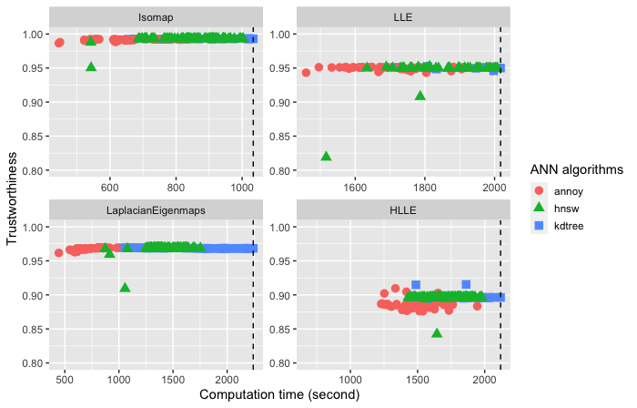
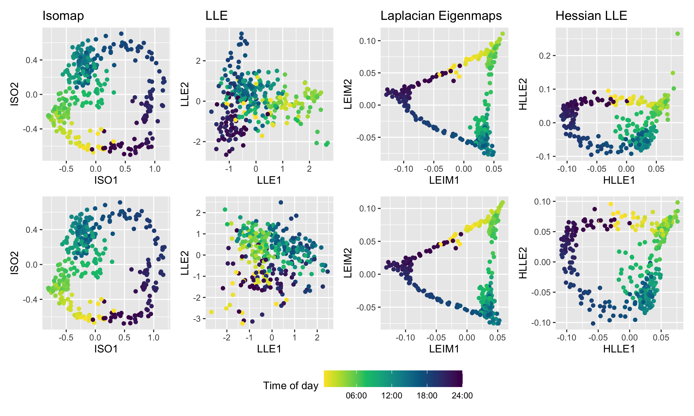

```{r, include = FALSE}
current_file <- knitr::current_input()
```
```{r titleslide, child="assets/titleslide.Rmd"}
```


---
# Irish Smart Meter Data

- Problem of interest: electricity usage patterns of households

- Half-hourly data for 535 days in 3639 households

- Empirical discrete distributions: $48 \times 7=336$ distributions per household

```{r smartmeter, fig.align = 'center', out.width = "80%", fig.cap="Two smart-meter demand examples from the Irish smart meter data set.", echo = FALSE, message=FALSE, warning=FALSE}
# knitr::include_graphics("smartmeter.png")
load("smartmeter_2id.rda")
library(shiny)
div(
  plotly::ggplotly(p, width=600, height=400),
  align = "center")
```


---

# How to estimate emprical distributions?

- *Objective*: to approximate the distribution of electricity demand $d_{i,t}$ for household $i$ over time period $t$

- *Steps*: 

      - Group all data and construct an evenly spaced grid $\kappa_0,\kappa_1,\dots,\kappa_G$ of size $G=200$ with $\kappa_0=\underset{i,t}{\min} d_{i,t}$ and $\kappa_G=\underset{i,t}{\max} d_{i,t}$ as endpoints.
      
      - Compute $\pi_{i,g}=(1/T)\sum_t I(\kappa_{g-1}<d_{i,t}<\kappa_g)$ where $T$ is the total number of time periods.
      
      - Vector $\pi_i$ represents a probability mass function over discrete bins.

???

- Why quantiles over kernel density estimate?

    - Missing values; highly skewed data; non-negative support

---
class: inverse, center, middle

# Why manifold learning?

## To work with 336 distributions per household

---

# Manifold learning

- *Manifold*: where the data set lies on a low-dimensional Euclidean space embedded in a high-dimensional feature space

- Manifold learning: non-linear dimension reduction tool
*by preserving the local geometry structure*. 

- Manifold learning methods: Isomap, LLE, Laplacian eigenmaps, etc. 
    

.center[
 ]

???
to extract the representation of data lying along a low-dimensional manifold embedded in the high-dimensional space
---

# Manifold Learning for Single Household

- Similar times of day are grouped closely together

- Cyclical patterns observed in the representation

- Three clusters roughly corresponding to three phases of a typical day
    
    working during the day (08:00 - 17:00);
    recreation during the evening (17:00 - 00:00);
    sleeping (00:00 - 08:00)

```{r nnembedding, fig.align = 'center', out.width = "70%", fig.cap="", echo = FALSE, message=FALSE}
knitr::include_graphics("tod_1id1row_1id336tow.png")
```

???
The cyclical pattern observed in the representation is indicative of the fact that low values for half hour of the day (00:00, 00:30, 01:00) are temporally proximate to high values for half hour of the day (22:30, 23:00, 23:30) and are therefore similar.
---
class: inverse, center, middle

# But what about **8 million** households in VIC? 

## Computational efficiency matters

---

# Manifold Learning with Approximate Nearest Neighbors

.pull-left[
- We propose to improve the efficiency by searching for approximate nearest neighbors (ANN) instead of exact ones. 

- **Goal**: largely decrease the computation time without losing much accuracy (high embedding quality)

- ANN methods: k-d trees, Annoy, HNSW
]

.pull-right[
```{r ann, fig.align = 'center', out.width = "50%", fig.cap="Illustration of approximate nearest neighbors compared to exact ones. ", echo = FALSE, message=FALSE}
knitr::include_graphics("ann.png")
```
]


---

# Manifold Learning with Approximate Nearest Neighbors


```{r compare, fig.align = 'center', out.width = "60%", fig.cap="Comaprison of three ANN methods for four ML methods on MNIST dataset. ", echo = FALSE, message=FALSE}

```

---
class: inverse, center, middle

# Application to electricity data

---

# For each household: electricity usage patterns

```{r annembedding, fig.align = 'center', out.width = "70%", fig.cap="2-d embeddings from four manifold learning methods, with the color representing half-hourly time of day. Top panel: Exact NN. Bottom panel: ANN. ", echo = FALSE, message=FALSE}

```

---

# For each household: anomaly detection

- High density region plots (Hyndman, 1996)

- Identify the most unusual observations (*"anomalies"*) with the lowest density

```{r hdr, fig.align = 'center', out.width = "70%", fig.cap="High density region plot from the Hessian LLE embeddings using exact NN (left panel) and ANN (right panel). The most typical points are shown in red, while the most anomalous are shown in black.", echo = FALSE, message=FALSE}
knitr::include_graphics("hdr10_comparehlle_1id336tow.png")
```

---
# For all households: anomaly detection

```{r hdrallid, fig.align = 'center', out.width = "60%", fig.cap="High density region plot for all households from the Isomap embeddings using exact NN (left panel) and ANN (right panel). ", echo = FALSE, message=FALSE}

```


---

class: inverse, center, middle

# Thanks!

Slides available at https://fancheng.me/talks/mbs2020/mlann.html

.pull-right[

*Website*: [fancheng.me](https://fancheng.me)

*Github*: [@ffancheng](https://github.com/ffancheng)

*Twitter*: [@fanchengfc](https://twitter.com/fanchengfc)

]

