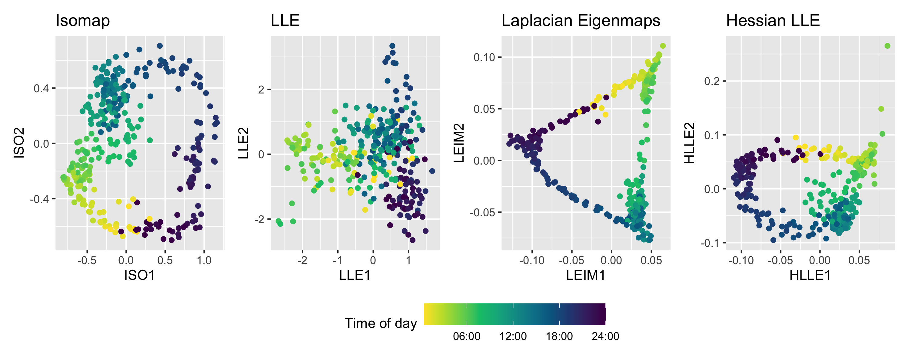

```{r, include = FALSE}
current_file <- knitr::current_input()
```

```{r titleslide, child="assets/titleslide.Rmd"}
```

---
# Thesis structure

- Introduction

- Manifold learning with approximate nearest neighbors [submitted to *JCGS*]

- Anomaly detection with kernel density estimation on manifolds

- Mixture model approximation in statistical manifold learning

- Conclusions and future plans

- Bibliography

---
class: inverse, center, middle

# Manifold learning with<br/>approximate nearest neighbors

---
class: split-two

# Irish Smart Meter Data 

.row[
.split-five[
.row[
]
.row[.content[
- Problem of interest: electricity usage patterns of households
]]
.row[.content[
- Typical/anomalous households in distributions
]]
.row[.content[
- Half-hourly data for 535 days in 3639 households
]]
.row[.content[
- Empirical discrete distributions: $48 \times 7=336$ distributions per household
]]
]
]


.row[
.split-two[
.column[
```{r smartmeter1, fig.align = 'center', out.width = "50%", fig.cap="Two smart-meter demand examples from the Irish smart meter data set.", echo = FALSE, message=FALSE, warning=FALSE}
# knitr::include_graphics("smartmeter.png")
load("images/smartmeter_3id.rda")
library(shiny)
div(
  plotly::ggplotly(p, width = 600, height = 350),
  align = "left")
```
]
.column[
```{r distributions, fig.align='center', out.width='85%', fig.cap='', echo=FALSE, message=FALSE, warning=FALSE}

```
]
]
]


???

# How to estimate empirical distributions?

- *Objective*: to approximate the distribution of electricity demand $d_{i,t}$ for household $i$ over time period $t$

- *Steps*:

      - Group all data and construct an evenly spaced grid $\kappa_0,\kappa_1,\dots,\kappa_G$ of size $G=200$ with $\kappa_0=\underset{i,t}{\min} d_{i,t}$ and $\kappa_G=\underset{i,t}{\max} d_{i,t}$ as endpoints.

      - Compute $\pi_{i,g}=(1/T)\sum_t I(\kappa_{g-1}<d_{i,t}<\kappa_g)$ where $T$ is the total number of time periods.

      - Vector $\pi_i$ represents a probability mass function over discrete bins.

- Why quantiles over kernel density estimate?

    - Missing values; highly skewed data; non-negative support

---
class: inverse, center, middle

# Why manifold learning?

---
class: split-two

.row[
.center.monash-bg-blue.white[
# Manifold learning
]
- *Manifold*: where the data set lies on a low-dimensional subspace embedded in a high-dimensional space

- Manifold learning: non-linear dimension reduction tool
*by preserving the local geometry structure*

- Statistical manifold: manifold with each observation as a PDF

]

.row[.center[

]
]


---
class: split-two
count: false

.row[
.center.monash-bg-blue.white[
# Manifold learning
]
- *Manifold*: where the data set lies on a low-dimensional subspace embedded in a high-dimensional space

- Manifold learning: non-linear dimension reduction tool
*by preserving the local geometry structure*

- Statistical manifold: manifold with each observation as a PDF

]

.row[
```{r isoembed, fig.align = 'center', out.width = "80%", fig.cap="", echo = FALSE, message=FALSE}

```
]


???
to extract the representation of data lying along a low-dimensional manifold embedded in the high-dimensional space

# Manifold Learning for Single Household

- Similar times of day are grouped closely together

- Cyclical patterns observed in the representation

- Three clusters roughly corresponding to three phases of a typical day
    
    working during the day (08:00 - 17:00);
    recreation during the evening (17:00 - 00:00);
    sleeping (00:00 - 08:00)

```{r nnembedding, fig.align = 'center', out.width = "70%", fig.cap="", echo = FALSE, message=FALSE}

```

The cyclical pattern observed in the representation is indicative of the fact that low values for half-hour of the day (00:00, 00:30, 01:00) are temporally proximate to high values for half-hour of the day (22:30, 23:00, 23:30) and are therefore similar.


---
# Manifold learning

- Manifold learning methods

    Isomap, LLE, Laplacian eigenmaps, Hessian LLE, etc.

- Most methods involve the nearest neighbor computation

- Computation complexity: $\mathcal{O}(N^2)$

- Distances between distributions: Hellinger/Total Variation distance

???
NN searching requires computing all pairwise distances.

It works for small N, but there is a computation bottleneck for large N.

---
class: inverse, center, middle

# But what about **8 million** households in VIC? 

## Computational efficiency matters

---
class: split-two

# Manifold learning with approximate nearest neighbors

.pull-left[.content[
- We propose to improve the efficiency by searching for approximate nearest neighbors (ANN) instead of exact ones. 

- **Goal**: largely decrease the computation time without losing much accuracy (high embedding quality)

- ANN methods: k-d trees, Annoy, HNSW
]]

.pull-right[
```{r ann, fig.align = 'center', out.width = "50%", fig.cap="Illustration of approximate nearest neighbors compared to exact ones. ", echo = FALSE, message=FALSE}
knitr::include_graphics("images/ann.png")
```
]

???
k-d trees is one of the classic way to find ANN.

Annoy and HNSW are brought up in the recent 5 years. And they both work better than k-d trees. [ann-benchmark.com]

---
# Approximate nearest neighbors comparison

- Recall rate (the fraction of true nearest neighbors found) against time

```{r recall, fig.align = 'center', out.width = "60%", fig.cap="Comparison of three ANN methods on MNIST dataset", echo = FALSE, message=FALSE}

```

???
- Recall rate measures the efficiency in finding NN.

- But finding more true NN does not necessarily give better performance in ML

- Therefore, we need other metrics for good embedding quality in ML.

---
# Embedding quality measures

- Trustworthiness (Venna & Kaski 2006) to distinguish one type of errors where

      the embedding point $y_j$ is among the $K$-nearest neighbors of $y_i$ ( $V_K(i)$ ) but 
      
      the data point $x_j$ is not among the $K$-nearest neighbors of $x_i$ ( $U_K(i)$ ) 
      
- Using all such points for each $i$, the trustworthiness of the embedding is
$$M_{T}(K)=1-\frac{2}{G_{K}} \sum_{i=1}^{N} \sum\limits_{\begin{subarray}{c}j \in V_{K}(i)\\j \notin U_{K}(i)\end{subarray}}(\rho_{ij}-K), \ M_{T}(K) \in [0,1]$$
      
      - $G_{K}$ is the normalizing factor calculated using $N$ and $K$
      - $\rho_{ij}$ is the neighborhood ranking of $x_j$ with repect to $x_i$


???

with a higher value indicating a higher-quality representation

$U_K(i)$ was defined as the set of points $j$ such that $x_j$ is one of the $K$-nearest neighbors of $x_i$. 
We now also define $V_K(i)$ as the nearest neighborhood of observation $i$ in the output space, i.e. a set of points $j$ such that $y_j$ is one of the $K$-nearest neighbors of $y_i$. 

We define the neighborhood ranking of $x_j$ with respect to $x_i$ as $\rho_{ij} =|\{\ell: \delta_{i \ell}<\delta_{i j}\} |$. 

For example, if $x_j$ is the nearest neighbor of $x_i$, then $\rho_{ij}=1$ since only $\delta_{ii}<\delta_{ij}$, where we assume without loss of generality that all input points are distinct.


---
# MNIST embedding quality vs computation time

```{r compare, fig.align = 'center', out.width = "70%", fig.cap="Comparison of three ANN methods for four ML methods on MNIST dataset. ", echo = FALSE, message=FALSE}
knitr::include_graphics("images/compareml.png")
```

---
class: inverse, center, middle

# Application to electricity data

---
# For all households: anomaly detection

- Distances between distributions

- Highest density region plots (Hyndman, 1996)

- Identify the most unusual observations (*"anomalies"*) with the lowest density

```{r hdrallid, fig.align = 'center', out.width = "60%", fig.cap="High density region plot for all households from the Isomap and LLE embeddings.", echo = FALSE, message=FALSE}

```

---
# Anomaly detection

```{r anomaly, fig.align = 'center', out.width = "60%", fig.cap="Quantile region plots of electricity demand against the time of week for one typical household and two anomalies. ", echo = FALSE, message=FALSE}

```

---
class: inverse, center, middle

# Anomaly detection with kernel density estimation on manifolds

---
# Research question 

- Manifold learning assumption: recover geometry (distances)

- Isometry: a manifold learning algorithm $f:\mathcal{M}\rightarrow \mathbb{R}^r$ is an isometry if
$$
d_\mathcal{M}(p_i, p_j) = d(f(p_i),f(p_j)), \text{ for all } i,j
$$

- Alternatively, Perrault-Joncas & Meila (2013) estimate the Riemannian Metric to measure the distortion at each point

<!-- - Use the Riemannian metric in kernel density estimation -->

```{r sr, fig.align = 'center', out.width = "50%", fig.cap = "Figure from Perrault-Joncas & Meila (2013): (a) Swissroll with a hole in R3; (b) LTSA embedding of the manifold in R2 along with metric.", echo = FALSE, eval=TRUE}

```

???
- To preserve the geometry of the manifold we need to preserve distances.

- World map distances between two locations are not geometric distances.

- Ellipses show how the distances between points are distorted. (Circles if no distortions) Horizontally stretched out. 

---
# Metric Learning algorithm

1. Construct a weighted neighborhood graph $\mathcal{G}_{w,\varepsilon}$ with weight matrix $W$ where $w_{i,j}=\exp(-\frac{1}{\varepsilon}\|p_i-p_j\|^2)$ for data points $p_i,p_j \in \mathbb{R}^r$

2. Calculate the $n\times n$ geometric graph Laplacian $\widetilde{\mathcal{L}}_{\varepsilon,n}$

3. Embed each data point $p\in \mathbb{R}^r$ to embedding coordinates $f_n(p)=(f_n^1(p),\dots,f_n^s(p))$ by any existing manifold learning algorithm

4. Obtain the embedding metric $h_n(p)$ at each point by applying the graph Laplacian $\widetilde{\mathcal{L}}_{\varepsilon,n}$ to the embedding coordinates $f_n$

- **Output**: $(f_n(p), h_n(p))$, where $f_n(p)$ is $n \times 1$ and $h_n(p)$ is $d \times d$

???
The ellipse in the embedding plot is based on the metric $h_n(p)$.

The last step of the algorithm can be done by first calculating the matrix $\tilde h_n(p)$ with each element being 
$$
\tilde{h}_{n}^{i j}=\frac{1}{2}\left[\tilde{\mathcal{L}}_{\epsilon, n}\left(f_{n}^{i} \cdot f_{n}^{j}\right)-f_{n}^{i} \cdot\left(\tilde{\mathcal{L}}_{\epsilon, n} f_{n}^{j}\right)-f_{n}^{j} \cdot\left(\tilde{\mathcal{L}}_{\epsilon, n} f_{n}^{i}\right)\right],
$$

---
# Multivariate kernel density estimate

Consider a multivariate kernel density estimate (KDE) with Gaussian kernel and bandwidth matrix $\mathbf{H}_i$ where
$$\begin{aligned}
\hat{f}(\mathbf{x})&=\sum\limits_{i=1}^N K_{\mathbf{H}_i}(\mathbf{x}-\mathbf{x}_i),\\
K_{\mathbf{H}_i}(\mathbf{x}-\mathbf{x}_i)&=(2\pi)^{-d/2}|\mathbf{H}_i|^{-1/2}\exp\left[-\frac{1}{2}(\mathbf{x}-\mathbf{x}_i)'\mathbf{H}_i^{-1}(\mathbf{x}-\mathbf{x}_i)\right]
\end{aligned}$$

- In Chapter 1, the HDR plots use KDE with a $H$ matrix proportional to identical matrix

- *Metric Learning* algorithm provides extra information for each point with a square matrix

- Replace $\mathbf{H}_i$ with $g_i$ for KDE to account for geometric distortion

<!-- - Variable kernel density estimation [Terrell 1992] -->

???
- Chapter 1 does not account for isometry. $H$ proportional to an identity matrix

- square matrix to account for the distortions on the manifold

---
# Multivariate kernel density estimate

For the Gaussian kernel and bandwidth matrix $\mathbf{H}_i$ where
$$K_{\mathbf{H}_i}(\mathbf{x}-\mathbf{x}_i)=(2\pi)^{-d/2}|\mathbf{H}_i|^{-1/2}\exp\left[-\frac{1}{2}(\mathbf{x}-\mathbf{x}_i)'\mathbf{H}_i^{-1}(\mathbf{x}-\mathbf{x}_i)\right]$$
.info-box[.content[
- $(\mathbf{x}-\mathbf{x}_i)'\mathbf{H}_i^{-1}(\mathbf{x}-\mathbf{x}_i)$ resembles a squared distance where the bandwidth determine directions to "close" points

- $|\mathbf{H}_i|^{-1/2}$ resembles a volume form of a linear transformation

- Volumn of a subset $V\subset \mathcal{M}$: $Vol(V)=\int_V \sqrt{\|g\|} dx^1\dots dx^d$
]
]


???
By replacing $\mathbf{H}_i$ with the output of the Metric Learning algorithm, the kernel density of the points on the manifold can be estimated while accounting for the geometric distortion of the manifold learning algorithm. 

In spirit, this idea follows the estimator of @Pelletier2005-vu, but the geometric properties of the manifold are also learned from the data.

- **Connections with Metric Learning**:

    - $(\mathbf{x}-\mathbf{x}_i)'\mathbf{H}_i^{-1}(\mathbf{x}-\mathbf{x}_i)$ resembles a squared distance where the bandwidth determine directions to "close" points.
    - $|\mathbf{H}_i|^{-1/2}$ resembles a volume form of a linear transformation. 

<!-- --- -->
<!-- # Riemannian metric -->

<!-- Definition: for every point $p \in \mathcal{M}$, the Riemannian metric $g$ is a symmetric and positive definite tensor field which defines an **inner product $<,>_g$** on the tangent space $T_p\mathcal{M}$. -->

<!-- Define the inner product between two vectors $\mathbb{u},\mathbb{v} \in T_p\mathcal{M}$ as $<\mathbb{u},\mathbb{v}>_g=g_{ij}u^iv^j$, then some geometric quantities are -->

<!-- - Vector norm: $\|\mathbb{u}\|=\sqrt{<\mathbb{u},\mathbb{v}>_g}$ -->
<!-- - Angle between vectors: $\cos{\theta}=\frac{<\mathbb{u},\mathbb{v}>_g}{\|\mathbb{u}\| \|\mathbb{v}\|}$ -->
<!-- - Arc length of a curve $c\in \mathcal{M}$: $l(c)=\int_a^b \sqrt{g_{ij} \frac{dx^i}{dt} \frac{dx^j}{dt}} dt$ -->
<!-- - Volume of a subset $V\subset \mathcal{M}$: $Vol(V)=\int_V \sqrt{\|g\|} dx^1\dots dx^d$ -->

<!-- Both the concepts of distance and volume are relevant to kernel density estimation. -->


<!-- ??? -->
<!-- If the inner product of the tangent space [if exists] is known for a given geometry, the Riemannian metric is a good measure to recover the geometry of a manifold. -->

<!-- A Riemannian manifold is a smooth manifold with a Riemannian metric defined at each point. -->

---
# Proposed schematic

```{r vkde, fig.align = 'center', out.width = "95%", fig.cap = "The proposed schematic for kernel density estimation on manifolds.", echo = FALSE, eval=TRUE}
knitr::include_graphics("images/vkde.png")
```

---
class: inverse, center, middle

# Mixture model approximation in statistical manifold learning

---

# Mixture model assumption

- In Chapter 1, we approximate the data with discrete distributions and calculate the Hellinger/Total Variation distance

- FINE (Fisher Information Nonparametric Embedding; Carter et al. 2009) 

- I propose assuming the data as realizations from distributions that belong to a statistical manifold

    - flexible parametric distributions
    - known intrinsic manifold dimension
    - exact instead of approximate Fisher information metric

???
FINE approximates the Fisher information distance between two kernel density estimates with Kullback-Leibler divergence and the shortest path algorithms that traverse the geodesic of the statistical manifold

[^1]: Fisher information distance between two distributions $p(x;\theta_1)$ and $p(x;\theta_2)$ is defined as 
\begin{equation}
\label{fisher}
D_{F}\left(\theta_{1}, \theta_{2}\right)= \min _{\theta(\cdot):} \int_{0}^{1} \sqrt{\left(\frac{d \theta}{d t}\right)^{T}[\mathcal{I}(\theta)]\left(\frac{d \theta}{d t}\right)} d t, 
\end{equation}
where $\theta=\theta(t)$ is the parameter path along the manifold with $\theta(0)=\theta_{1}$ and $\theta(1)=\theta_{2}$, and $\mathcal{I}(\theta)$ is the Fisher information matrix 

FINE only works locally because of the approximation using KL divergence and graph shortest distance. 

Fisher information matrix measures how much information is contained in a random variable with an unknown parameter $\theta$.


---
# Timeline

| Date                 | Tasks
|---------------------|--------------------------------------------------------------|
| Feb 2019 - Feb 2020 | $\checkmark$ Review literature and propose research questions  |
|                      | $\checkmark$ Visualize and explore toy datasets and smart meter data  |
|                      | $\checkmark$ Work on confirmation report and thesis structure  |
| Mar 2020 - Jul 2020 | $\checkmark$ Explore approximate nearest neighbor searching methods in manifold learning   |
|                      | $\checkmark$ Finish the first paper on **manifold learning with approximate nearest neighbors**  |
| Aug 2020 - Feb 2021 | $\checkmark$ Combine kernel density estimation with the Riemannian metric          |
| Mar 2021 - Jul 2021 | • Draft the second paper on **kernel density estimation on manifolds**         |
| Aug 2021 - Feb 2022  | • Explore Fisher information distance between parametric distributions        |
| Mar 2022 - May 2022 | • Draft the third chapter on **mixture model approximation in statistical manifold learning**   |
|                      | • Finalise the thesis                               |


---
class: inverse, center, middle

# Thanks!

Slides available at https://fancheng.me/talks/midcandidature/slides.html

.pull-right[

<!-- *Website*: [fancheng.me](https://fancheng.me) -->

*Github repo*: [@ffancheng/paper-mlann](https://github.com/ffancheng/paper-mlann)

<!-- *Twitter*: [@fanchengfc](https://twitter.com/fanchengfc) -->

]

